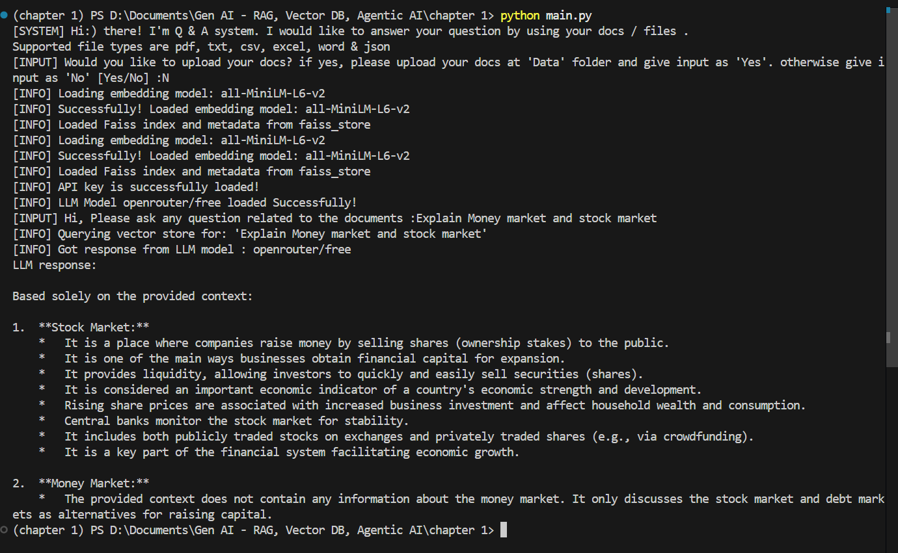

# RAG-based Document Q&A System
## Overview
This project is a RAG (Retrieval-Augmented Generation) based Question & Answer system built using Python, LangChain, FAISS, and LLMs. It allows users to upload documents and ask questions about them. The system reads the documents, converts them into vector embeddings, stores them in a FAISS vector database, and retrieves relevant content to generate answers using a Large Language Model (LLM)

**Supported file types:** PDF, TXT, CSV, Excel, Word & JSON

## Project Architecture

## How to run the project
1. Clone the repository  
>       git clone https://github.com/Amirdh17/Langchain_RAG_System  
2. Create a virtual environment
>       python -m venv venv
>
>       venv\Scripts\activate
3. Install required dependencies
>       pip install -r requirements.txt
4. Create .env file and setup your GenAI API key
>       GENAI_API_KEY=your_openrouter_api_key
5. Run the appilcation using following command
>       python main.py
6. Upload the documents into data folder when application ask for it and give 'yes' as input. If you have already loaded document into vector store, you can give 'no'.
7. Ask the question when application ask for it.   

## Sample Output

