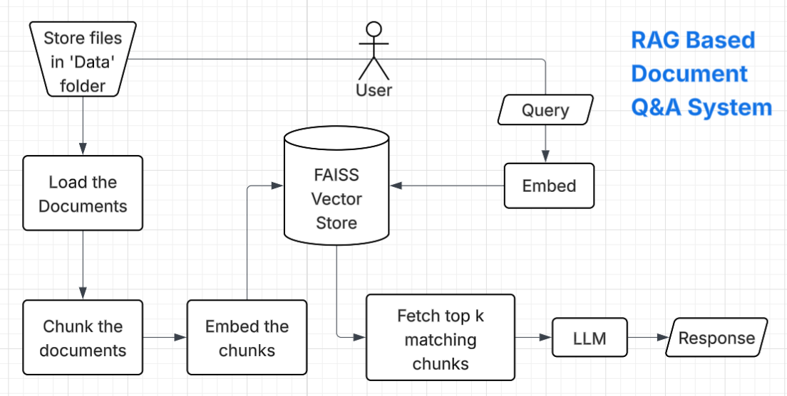

# RAG-based Document Q&A System
## Overview
This project is a RAG (Retrieval-Augmented Generation) based Question & Answer system built using Python, LangChain, FAISS, and LLMs. It allows users to upload documents and ask questions about them. The system reads the documents, converts them into vector embeddings, stores them in a FAISS vector database, and retrieves relevant content to generate answers using a Large Language Model (LLM)

**Supported file types:** PDF, TXT, CSV, Excel, Word & JSON

## Project Architecture
